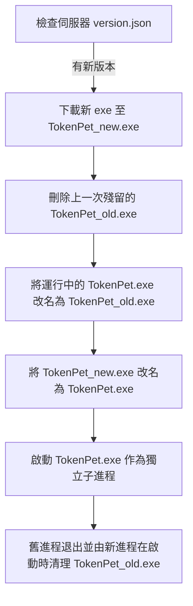

# Windows PyInstaller 熱更新與重啟機制深度解析

本文檔詳細分析了在 Windows 平台下，基於 PyInstaller 單一打包檔 (`--onefile`) 進行熱更新與進程重啟時所面臨的底層限制、問題根源，以及對應的完整解決方案。您可以將此文檔提供給目標電腦的 Agent 以進行代碼修復與驗證。

---

## 1. Windows 熱更新的核心流程

在 Windows 系統中，正在運行的 `.exe` 及其加載的動態連結庫 (`.dll`) 會被作業系統強制施加檔案鎖定，無法直接進行覆蓋或刪除。為了實現無縫熱更新，我們採用了 **Windows 原生重新命名機制**：



---

## 2. 核心技術痛點與解決方案

### 痛點 A：DLL 資源鎖定與 `failed to remove temporary directory`
* **根源分析**：
  PyInstaller 啟動時會將 Python 解壓至臨時目錄 `%TEMP%\_MEIxxxxxx`，並將該目錄**置於環境變數 `PATH` 的最前端**，以便 Python 直譯器加載依賴項。
  若舊進程拉起新進程時直接複製 `os.environ`，新進程會**繼承這個含有舊目錄的 `PATH` 變數**。新進程啟動後，會直接去加載舊進程臨時目錄底下的 `python312.dll`。當舊進程結束試圖刪除 `%TEMP%\_MEIxxxxxx` 時，就會因為 DLL 被新進程佔用鎖定而報錯，導致暫存資料夾無法被清理。
* **解決方案**：
  在啟動子進程前，必須深度淨化 `clean_env`，除了剔除 `_MEIPASS` 等變數外，還必須**過濾掉 `PATH` 中所有指向父進程臨時目錄的片段**：
  ```python
  # 淨化環境變數，防止子進程繼承父進程的 _MEI 暫存目錄
  clean_env = os.environ.copy()
  for var in ("_MEIPASS", "_MEIPASS2", "PYTHONPATH", "PYTHONHOME", "PYTHONNOUSERSITE"):
      clean_env.pop(var, None)
      
  # 過濾 PATH 中包含父進程臨時目錄路徑的片段
  meipass_dir = getattr(sys, "_MEIPASS", "")
  if meipass_dir:
      path_val = clean_env.get("PATH", "")
      path_segs = path_val.split(";")
      # 排除含有當前 _MEIPASS 或 _mei 的暫存路徑，強迫新進程開闢並使用自己的全新臨時目錄
      cleaned_segs = [seg for seg in path_segs if meipass_dir.lower() not in seg.lower() and "_mei" not in seg.lower()]
      clean_env["PATH"] = ";".join(cleaned_segs)
  ```

---

### 痛點 B：子進程生命週期綁定與 DLL 損壞
* **根源分析**：
  若使用簡單的 `os.startfile` 或未隔離的 `subprocess.Popen`，子進程會共享父進程的 I/O 句柄與控制終端。當父進程退出時，會強行破壞與回收相關資源，導致剛拉起的新進程拋出 `failed to start embedded python interpreter`。
* **解決方案**：
  使用 `close_fds=True`（不繼承任何文件描述符）與 `creationflags=subprocess.DETACHED_PROCESS`（完全脫離控制台與父進程的進程組）啟動子進程：
  ```python
  import subprocess
  subprocess.Popen([current_exe], env=clean_env, close_fds=True, creationflags=subprocess.DETACHED_PROCESS)
  ```

---

### 痛點 C：Python 局部變數作用域陷阱 (UnboundLocalError)
* **根源分析**：
  在重啟函數內，若寫了 `import sys`，Python 編譯器在進行語法分析時，會將 `sys` 標記為該函數的**區域變數 (Local Variable)**。這會導致函數開頭第一行對 `sys.frozen` 的讀取操作（例如 `if not getattr(sys, 'frozen', False):`）在 `import sys` 執行之前被調用，因而拋出 `UnboundLocalError: cannot access local variable 'sys' where it is not associated with a value` 錯誤，造成熱更新在最前端直接卡死。
* **解決方案**：
  不要在函數內局部導入 `import sys`，直接在程式最頂層全局導入 `import sys`，函數內部直接共享全局變數即可。

---

## 3. 完整修復後代碼對比 (Diff)

以下是修復前後的 `emojinoko_monitor.py` 中 `_download_and_swap` 函數的代碼對比：

```diff
     def _download_and_swap(self, dl_url):
         """下載/複製新的 exe，並以 Windows 原生重命名機制無縫替換與重啟"""
         try:
+            # 全局 sys 模組已在最頂部導入，此處切勿重複 'import sys'
             if not getattr(sys, 'frozen', False):
                 self.root.after(0, lambda: messagebox.showinfo("更新資訊", "目前為開發原始碼運行模式，不支援自動替換更新。"))
                 return
                 
             # 1. 開始下載/複製至新檔案暫存路徑
             is_dl_file_path = not (dl_url.lower().startswith("http://") or dl_url.lower().startswith("https://"))
             if is_dl_file_path:
                 import shutil
                 shutil.copy2(dl_url, new_exe_path)
             else:
                 r = requests.get(dl_url, stream=True, timeout=30)
                 if r.status_code == 200:
                     with open(new_exe_path, "wb") as f:
                         for chunk in r.iter_content(chunk_size=8192):
                             if chunk:
                                 f.write(chunk)
                 else:
                     raise Exception(f"下載失敗，HTTP 狀態碼: {r.status_code}")
                 
             # 2. 清理上一次的舊備份檔 (若存在)
             if os.path.exists(old_exe_path):
                 try:
                     os.remove(old_exe_path)
                 except Exception:
                     pass
             
             # 3. 執行原生重命名替換 (Windows 允許重命名正在運行的執行檔)
             os.rename(current_exe, old_exe_path)
             os.rename(new_exe_path, current_exe)
             
             # 4. 啟動替換後的新執行檔
             # 建立乾淨的環境變數，並排除所有與當前 PyInstaller 臨時目錄相關的變數
             clean_env = os.environ.copy()
             for var in ("_MEIPASS", "_MEIPASS2", "PYTHONPATH", "PYTHONHOME", "PYTHONNOUSERSITE"):
                 clean_env.pop(var, None)
-            
-            # 使用 subprocess.Popen 啟動子進程：
-            # - close_fds=True: 確保不繼承父進程的任何檔案描述符與暫存資料夾控制把手，防止暫存資料夾被鎖定
-            # - creationflags=subprocess.DETACHED_PROCESS: 讓子進程成為完全獨立的脫離進程，釋放父進程控制權
-            import subprocess
-            subprocess.Popen([current_exe], env=clean_env, close_fds=True, creationflags=subprocess.DETACHED_PROCESS)
+                
+            # 必須同時清理 PATH 變數中屬於父進程 _MEIPASS 暫存目錄的路徑，
+            # 避免子進程繼承此 PATH 而去加載父進程即將被刪除的 python312.dll，造成資源鎖定與 interpreter 初始化失敗！
+            meipass_dir = getattr(sys, "_MEIPASS", "")
+            if meipass_dir:
+                path_val = clean_env.get("PATH", "")
+                path_segs = path_val.split(";")
+                cleaned_segs = [seg for seg in path_segs if meipass_dir.lower() not in seg.lower() and "_mei" not in seg.lower()]
+                clean_env["PATH"] = ";".join(cleaned_segs)
+            
+            # 使用 subprocess.Popen 啟動子進程：
+            # - close_fds=True: 確保不繼承父進程的任何檔案描述符與暫存資料夾控制把手，防止暫存資料夾被鎖定
+            # - creationflags=subprocess.DETACHED_PROCESS: 讓子進程成為完全獨立的脫離進程，釋放父進程控制權
+            import subprocess
+            subprocess.Popen([current_exe], env=clean_env, close_fds=True, creationflags=subprocess.DETACHED_PROCESS)
             
             # 5. 立刻關閉當前舊進程
             self.root.after(0, self.root.destroy)
             
         except Exception as e:
             self.root.after(0, lambda: messagebox.showerror("更新錯誤", f"下載更新失敗: {str(e)}"))
```
